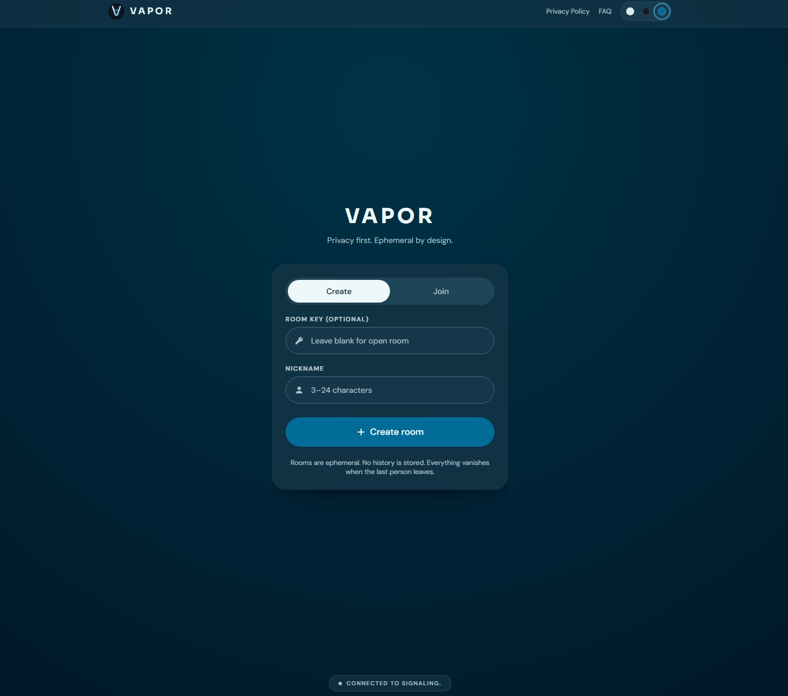

# Vapor

**Privacy first. Ephemeral by design.**

Vapor is a zero-persistence, browser-based chat utility. No accounts, no logs, no history — rooms exist only in server RAM and vanish when the session ends. Messages and files travel directly between users over WebRTC; the server handles signaling only.

---

## User Guide

### The Lobby



The lobby is the single entry point. Switch between **Create** and **Join** tabs depending on your role.

---

### Creating a Room

1. Select the **Create** tab.
2. Enter an optional **Room Key** (password). Leave blank for an open room.
3. Enter a **Nickname** (3–24 characters).
4. Click **+ Create room**.

On success, you enter the room as the **host**. You'll receive a Room ID — share it (and the password if you set one) with participants you want to invite.

> **Optional room name:** You can also set a custom room name (3–24 characters, letters/digits/hyphens/underscores) instead of using the auto-generated Room ID. Custom names must be unique across active rooms. Guests can join using the room name or the raw Room ID — both work.

**Host limits and rules:**
- Maximum 5 participants per room (host included).
- The host controls the room's lifetime — leaving immediately destroys the room for everyone.
- Once set, neither the room name nor the password can be changed.

---

### Joining a Room

1. Select the **Join** tab.
2. Enter the **Room ID** (or custom room name) shared by the host. Room IDs are case-sensitive.
3. Enter the **Room Key** if the room is password-protected.
4. Enter your **Nickname** (3–24 characters, must be unique within the room).
5. Click **Join room**.

On success you enter the room as a **guest** and the P2P mesh is established automatically.

**Common join errors:**

| Error | Meaning |
|---|---|
| Room not found | The Room ID doesn't exist or the room has already ended. |
| Incorrect password | Wrong or missing password for a protected room. |
| Room is full | The room already has 5 participants. |
| Nickname taken | Choose a different nickname — your preferred one is reserved by another participant. |
| Too many attempts | Temporary rate limit from the server. Wait before retrying. |

---

### In the Room

Once connected, all messages and file transfers flow directly peer-to-peer (WebRTC). The server is no longer in the data path.

**Room header** shows the Room ID with a copy button and a live countdown timer displaying the time until the room expires. The timer hides automatically when you're typing and reappears when you stop.

**Participant list** shows all connected participants with color-coded nicknames. On mobile it is collapsed by default; on desktop it is open by default.

**Leaving:** Click the Leave button. As a guest, you return to the lobby and the room continues for others. As the host, leaving immediately destroys the room for everyone.

---

### Disconnects and Reconnection

Vapor distinguishes between **voluntary leave** (you clicked Leave) and an **unexpected disconnect** (network drop, browser crash, tab refresh).

#### If you disconnect unexpectedly

Your session is held open with a grace window so you can reconnect without losing your nickname or place in the room. On page refresh or reconnect, Vapor automatically attempts to resume your session.

| Role | Grace window |
|---|---|
| Host | 60 minutes |
| Guest | 30 minutes |

During your grace window, other participants see you as offline but the room stays alive. Your nickname is reserved — no one else can take it while your grace is active.

If you reconnect within the window, your session is fully restored and chat history (stored locally in your tab) reloads. If the window expires, your session is permanently evicted and you must join as a new participant.

#### If the host disconnects

Guests see a **host grace banner** showing a countdown. The room stays active and chat continues normally during this time. If the host returns within 60 minutes, the banner clears and the room resumes. If the host does not return, the room is destroyed when the grace timer expires.

---

### Room Lifetime and Destruction

Every room has a **2-hour maximum lifetime** regardless of activity. Rooms can also end earlier:

| Reason | What happened |
|---|---|
| Host left | Host clicked Leave. Room ends immediately. |
| Host did not return in time | Host disconnected and the 60-minute grace window expired. |
| Room lifetime ended | The 2-hour maximum TTL was reached. |
| No active participants for too long | Only one participant (or none) remained in the room for 15 minutes with no return. |

When a room ends you are taken to the **Room Ended** screen with a short reason message and a button to return to the lobby.

---

### Privacy and Encryption

- **P2P data path:** Messages and files travel directly between browsers via WebRTC Data Channels (DTLS-encrypted). The server never sees your content.
- **Signaling encryption:** Room setup and coordination use TLS/WSS.
- **Zero persistence:** All room state lives only in server RAM. It is gone when the room ends or the server restarts. No database. No logs. No history.

---

## Stack

| Layer | Tech |
|---|---|
| Frontend | React + TypeScript (Vite) + Tailwind CSS |
| Backend | Node.js + Express + TypeScript |
| Real-time | Socket.IO (signaling only) |
| P2P | WebRTC Data Channels |

---

## Run Locally

```bash
# Install dependencies
npm install
cd backend && npm install && cd ..

# Start frontend + backend (from project root)
npm run dev
```

- Frontend: `http://localhost:5173`
- Backend: `http://localhost:3001`

## Run with Docker

```bash
npm run docker:up   # start
npm run docker:down # stop
```
