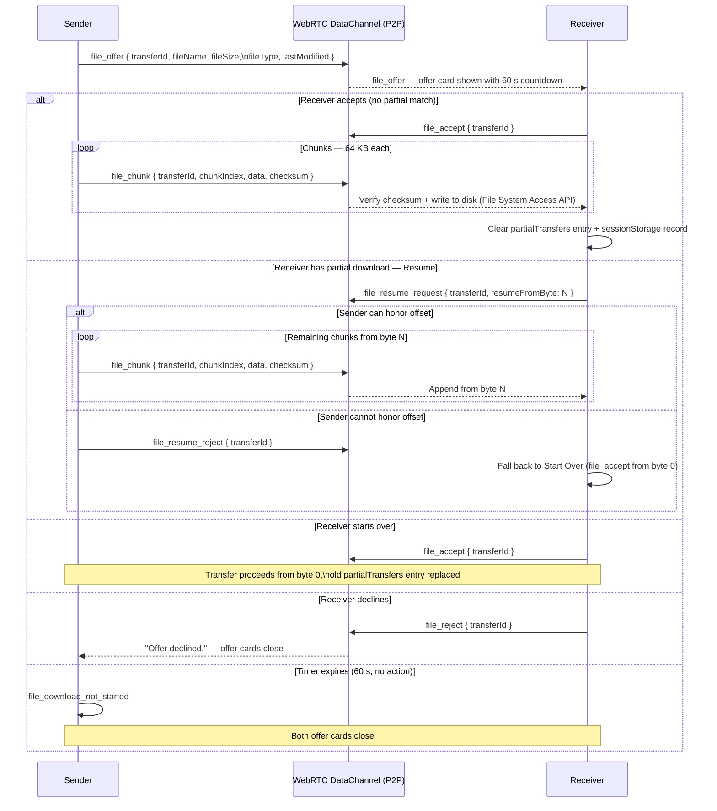

# Vapor File Transfer (Source of Truth)

Date: 2026-06-29

Part of the Vapor system-design source-of-truth set — navigate via [INDEX.md](./INDEX.md). This file owns the P2P file-transfer subsystem: architecture, ICE/NAT, chunking, the data-channel message types, consent/targeting flow, room-lifetime interaction, and session-scoped resume. File transfer reuses the WebRTC peer connection established in [signaling-contract.md](./signaling-contract.md) §7; the server is never involved in content. Constants are in [core-architecture.md](./core-architecture.md) §2.

## 1) Architecture

- File transfer is strictly P2P over WebRTC data channels. The server never sees, relays, or buffers file content or metadata at any point.
- File transfer reuses the same WebRTC peer connection established during signaling. No additional server infrastructure is required for content delivery.
- This is a non-negotiable privacy guarantee: the file transfer path is structurally identical to the chat path — server-blind by architecture, not by policy.
- **Eligibility:** File transfer is available whenever both the sender and receiver are live in the room (their `socketId` does not start with `"disconnected:"`). Room `RoomStatus` is irrelevant to transfer eligibility — two live participants may transfer files even if the host is in a grace window. Transfers in flight do not extend room lifetime or override lifecycle rules.

## 2) ICE / NAT Traversal Configuration

- **Initial launch: STUN only.** ICE candidates use public STUN servers. No TURN relay is configured at launch.
  - Covers roughly 80–85% of real-world connections (home broadband, most mobile networks).
  - ~15% of connections behind symmetric NAT (corporate networks, some mobile carriers) may fail to establish a direct P2P path. This limitation is documented transparently to users.
- **Planned: TURN fallback.** A TURN relay (Cloudflare Calls or Metered.ca free tier) may be added in a future phase to cover symmetric-NAT cases. TURN adds operational cost proportional to relay traffic and is deferred until user demand justifies it.
- ICE candidate priority order follows standard WebRTC behavior: host candidates (LAN) → server-reflexive (STUN) → relay (TURN). Peers on the same local network automatically negotiate a direct LAN path via host candidates without requiring STUN — no explicit same-network detection is needed in application code.

## 3) File Size, Chunking, and Data Channel Mode

- **Hard limit:** 2 GB per transfer (`FILE_TRANSFER_MAX_SIZE_BYTES`). Enforced client-side only. The server must never receive or log file metadata.
- **Chunk size:** 64 KB per chunk (`FILE_TRANSFER_CHUNK_SIZE_BYTES`). A 2 GB file produces 32,768 chunks. This provides good throughput at broadband speeds with enough granularity for meaningful per-chunk integrity checks and progress tracking.
- **Data channel mode:** Ordered + Reliable (WebRTC defaults: `ordered: true`, no `maxRetransmits`/`maxPacketLifeTime`). File bytes must arrive in sequential order; the alternative (unordered + application-layer sequencing) adds implementation complexity with no functional benefit at 64 KB chunk sizes on typical connections. All chunks must be delivered and verified — unordered or unreliable modes are not permitted.
- **Memory constraint:** Files must be streamed directly to disk during receive rather than accumulated in memory. Implementation must use the Web File System Access API (`showSaveFilePicker`) or StreamSaver.js as fallback — never buffer the entire file before offering download. See §6 for browser compatibility.
- **Backpressure:** Sender must check `dataChannel.bufferedAmount` before each chunk and pause when the buffer is full. Failure to do so overflows the send buffer and drops the connection.
- **Chunk integrity:** Each chunk must be verified on receipt. Corrupted chunks must be flagged and re-requested before the transfer is considered complete or eligible for resume.

## 4) P2P Data Channel Message Types

All messages below are exchanged directly over WebRTC data channels (JSON-encoded). The server has no visibility into any of these messages.

| Direction | Message type | Key fields |
|---|---|---|
| Sender → Receiver | `file_offer` | `transferId, fileName, fileSize, fileType, lastModified, senderParticipantId` |
| Receiver → Sender | `file_accept` | `transferId` |
| Receiver → Sender | `file_reject` | `transferId` — user explicitly declined |
| Receiver → Sender | `file_resume_request` | `transferId, resumeFromByte` |
| Sender → Receiver | `file_resume_reject` | `transferId` — sender cannot honor the resume offset |
| Sender → Receiver | `file_chunk` | `transferId, chunkIndex, data, checksum` |
| Either → Other | `file_cancel` | `transferId` |
| System (internal) | `file_download_not_started` | `transferId` — offer timed out without any receiver action |

`transferId` is sender-generated (UUID) and unique per offer instance. File identity for resume detection uses `transferKey = \`${fileName}:${fileSize}:${lastModified}\`` (see §8), which is independent of `transferId` and enables resume even if the file is re-offered by a different sender.

`lastModified` is sourced from `File.lastModified` (milliseconds since epoch) on the sender side and is required in every `file_offer`.

## 5) Consent and Targeting Flow

Receiver must explicitly accept a file before any transfer bytes are sent. No auto-download.

**Offer UI (chat view):**
- A file offer appears in the chat for both the sender and the receiver only — not broadcast to other participants.
- The offer card shows: file name, file size, a **Download** button, a **✕** (reject) button, and a visible countdown timer starting at 60 seconds (`FILE_OFFER_TIMEOUT_MS`).
- The timer ticks down in real time on both the sender's and receiver's offer card.
- If the receiver has a matching partial transfer (see §8), the **Download** button is replaced by **Resume** and **Start Over** buttons; the **✕** button and timer remain.

**Offer flow:**
1. Sender selects a target — a specific participant or "everyone in room." Target selector shows only live participants; peers in a grace window are not valid targets and must not appear.
2. Sender sends `file_offer` over the data channel to the selected target(s). The offer card appears in both participants' chat views.
3. On **Download (Accept):** receiver sends `file_accept`; sender begins chunked transfer from byte 0.
4. On **✕ (Reject):** receiver sends `file_reject`; sender sees "Offer declined." The offer card closes on both sides.
5. On **timer expiry (60 s, no action):** offer is voided; sender receives `file_download_not_started`. Both offer cards close. `file_download_not_started` is distinct from `file_reject` — it means the receiver did not act, not that they declined.
6. On **Resume:** receiver sends `file_resume_request` with `resumeFromByte`; see §8.
7. On **Start Over:** receiver sends `file_accept`; transfer proceeds from byte 0 and any existing partial state is replaced.

**"Everyone" targeting:** Sender sends N independent `file_offer` messages (one per live peer). Each peer receives their own independent offer card with their own 60-second timer. Each peer responds independently. This is 1-to-1 behavior per peer — one offer card, one timer, one accept/reject/timeout outcome per recipient. The sender tracks each response individually by `transferId`.

**Receiver disconnects after offer sent, before acceptance:** The offer is automatically voided when the receiver's peer connection drops. The sender receives a system notification that the offer was cancelled due to receiver unavailability. No transfer bytes are ever sent.

**Sender disconnects after offer sent, before acceptance:** All pending offer cards across all targeted peers auto-dismiss when the sender's peer connection drops. Receiver sees "Offer cancelled — sender disconnected." No transfer bytes are ever sent.

**Sender disconnects during active transfer:** Data channel closes; transfer dies immediately on the receiver side. Receiver gets a clear error; already-written bytes on disk are preserved. See §8 for session-scoped resume.

### Flow diagram

All file bytes are P2P over WebRTC DataChannels — the server is never involved.

## 6) Room Lifetime and Transfer Lifecycle

- **Room TTL is not suspended during file transfer.** The 2-hour hard TTL and all lifecycle rules apply regardless of transfer state.
- At any reasonable connection speed (≥ 5 Mbps), a 2 GB transfer completes in under 90 minutes and is well within the 2-hour TTL.
- **Expiry warning:** When room expiry is within `FILE_TRANSFER_EXPIRY_WARNING_MS` (15 min) and a transfer is in progress, the UI must display a persistent warning showing: (1) time remaining until room expires, (2) current transfer ETA (see ETA display rules below), and (3) whether the transfer is expected to complete before expiry.
- **ETA display rules:**
  - ETA > 1 hour → display in hours and minutes (e.g. "1 h 20 min remaining")
  - ETA 1–60 minutes → display in minutes (e.g. "14 min remaining")
  - ETA < 1 minute → display in seconds (e.g. "38 s remaining")
  - ETA is computed from a 5-second rolling throughput average.
- **Room destroyed mid-transfer:** WebRTC data channels close immediately. Both sides handle the `close` event gracefully. Already-written bytes on disk via the File System Access API remain on the receiver's device and are not deleted. In-memory chunks not yet written to disk are discarded. This partial file is eligible for session-scoped resume (§8).
- **Transfer termination rules:**
  - Peer disconnects mid-transfer → transfer dies immediately; the remaining side receives a clear error and frees allocated memory. Already-written bytes on disk are preserved.
  - Room is destroyed mid-transfer → same outcome.
  - Either party cancels via `file_cancel` → both sides clean up immediately. In all cancellation cases (sender or receiver), already-written bytes on disk are **not** automatically deleted. Vapor never automatically discards partial files — the user must delete them manually. The partial entry in `partialTransfers` remains and is eligible for resume.

**Download progress UI:** Transfer progress is displayed in a persistent bar at the bottom of the UI (below the chat view). It shows file name, bytes transferred / total, percentage, and ETA (per rules above). Chat interaction continues normally during transfer.

**Non-supporting browser handling:**
- The Vapor website must display a prominent browser compatibility notice informing users that file transfer requires a Chromium-based browser (Chrome, Edge, Arc, etc.) for full functionality, including resumable downloads.
- When a file offer arrives and the receiver's browser does not support the File System Access API (e.g. Firefox, iOS Safari), the receiver must be notified in-line within the offer card: "Your browser does not support resumable downloads. The file will be downloaded via a streaming fallback. Resume is not available." The offer card still shows Download / ✕; the Resume option never appears on non-supporting browsers.

## 7) Constraints

- Maximum one active transfer per peer-pair (A↔B is one pair; A↔C is a separate pair — concurrent transfers across different pairs are permitted).
- Server must never log, buffer, or inspect file metadata (name, size, type) or content.
- Transfer state is not included in `session_resumed` payloads. Reconnecting participants do not inherit in-flight transfer state.

## 8) Resumable Transfer (Session-Scoped)

A transfer interrupted by peer disconnect, room destruction, or cancellation may be resumed within the same browser session if the same file is offered again.

**File identity key:** `transferKey = \`${fileName}:${fileSize}:${lastModified}\``. A file is considered the same if all three values match, regardless of which participant sends it.

**Receiver state map:** `partialTransfers: Map<transferKey, { bytesReceived, fileHandle: FileSystemFileHandle | null, savedAt: number }>`.

**Metadata persistence (crash recovery):** When the receiver accepts a file offer, the transfer metadata `{ fileName, fileSize, lastModified, bytesReceived: 0 }` is immediately written to `sessionStorage` keyed by `transferKey` — before `showSaveFilePicker` is called and before any bytes flow. The file handle is acquired next (user picks a save location), then `fileHandle` is stored in the in-memory `partialTransfers` map. If the browser crashes after metadata is saved but before the file handle is acquired, `sessionStorage` retains the entry but `fileHandle` is null; on next load, the receiver is prompted to re-select a save location before resuming. If the browser crashes after the file handle is acquired, `fileHandle` is lost (it is in-memory only); again, on next load the user re-selects a save location and appending continues from `bytesReceived`.

`bytesReceived` in `sessionStorage` is updated after each chunk is successfully verified and written to disk.

**File naming on resume / restart:**
- If the original save path is still accessible (same tab, no crash), the existing partial file is appended to or overwritten from the correct byte offset.
- If the save path is not accessible (crash recovery), Vapor offers the user a new `showSaveFilePicker`. If the user picks the same file name and location, the existing partial file is overwritten from the resume offset. If they pick a new name, a fresh file is created from `resumeFromByte`.
- Vapor never silently overwrites without user confirmation via the file picker. If the implementation detects a name collision in the download directory, it may suggest a discriminated name (e.g. `file(1).zip`) but the user decides.

**Resume prompt:** When a new `file_offer` arrives whose `transferKey` matches an entry in `partialTransfers` (and `bytesReceived > 0`), the offer card shows:
> *"Incomplete download found for [fileName] ([X]% received). Continue from where you left off?"*
> **[Resume]** **[Start Over]** **[✕ Decline]** — with the 60-second timer running.

This prompt only appears on browsers that support the File System Access API. On non-supporting browsers (Firefox, iOS Safari), the standard Download / ✕ prompt is shown regardless of partial state — resume is not available and the prompt never appears.

**Resume flow:**
1. Receiver sends `file_resume_request { transferId, resumeFromByte: N }`.
2. Sender slices the source file from byte `N` (`File.slice(N)`) and begins chunking from that offset.
3. Receiver appends incoming chunks to the existing partial file from byte `N` using `createWritable({ keepExistingData: true })` + `seek(N)`.
4. Corrupted chunks are flagged and re-requested before appending.
5. On completion, the `partialTransfers` entry and its `sessionStorage` record are cleared.

**Start Over flow:** Receiver sends `file_accept`; transfer proceeds from byte 0. The existing `partialTransfers` entry is replaced (old `fileHandle` is explicitly closed before replacement).

**Sender-side resume rejection:** If the sender cannot honor the resume offset, sender sends `file_resume_reject`. Receiver falls back to Start Over behavior.

**Constraints:**
- Session-scoped only. Tab close clears `sessionStorage` — `partialTransfers` state is lost and resume is not possible in a new tab.
- Maximum one partial entry per `transferKey`. A new interruption for the same key replaces the existing entry; the old `fileHandle` is explicitly closed first to avoid resource leaks.
