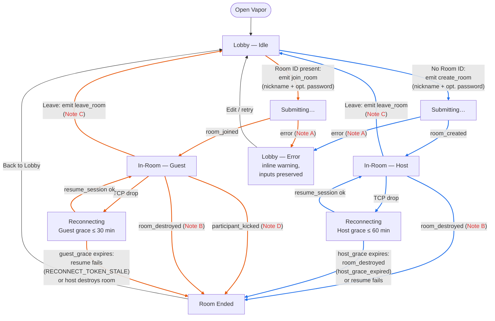

# Vapor Frontend UI Specification (Consolidated)

Date: 2026-06-22

## 1) Purpose

UI/UX specification for Vapor. Intentionally excludes low-level signaling/network implementation details.

Use this for:
- Screen layout review.
- Interaction behavior review.
- Copy and feedback-state review.
- Mobile-first usability review.
- Frontend-facing contract mapping (high-level, non-authoritative; System Design remains source of truth).

For code structure, key files, and hook/state architecture, see [frontend-overview.md](./frontend-overview.md).

---

## 2) UI Principles

- Mobile-first: all key actions are reachable and readable on small screens.
- Low cognitive load: only essential controls are visible at each stage.
- Privacy-forward language: avoid implying server-side chat/file storage.
- Fast feedback: every user action has immediate visible state.
- Ephemeral clarity: users should always understand session volatility.

---

## 3) Primary Screens

## A) Room Entry Screen
Purpose: create or join quickly.

Required elements:
- App title and short tagline.
- Room ID input (join flow).
- Password input.
- Primary action: Create room.
- Secondary action: Join room.
- Inline error area.

Behavior:
- Show loading state while request is in flight.
- Password is optional: empty input creates or joins an open room, and password is only required for protected rooms.
- Room ID is case-sensitive and must be submitted exactly as entered (no normalization).
- Keep copy generic for auth errors: use `INVALID_PASSWORD` messaging.
- Do not add join-attempt lockout UI; room-creation and join throttling are handled by backend abuse controls and rate limits.
- On success, transition immediately to room screen.

## B) Active Room Screen
Purpose: in-room interaction state.

Required elements:
- Room header: room identifier + copy-to-clipboard button + Room TTL timer.
- Participant count with expandable participant list.
- Leave button (always visible).
- Chat area: scrollable message history + text input + send button.
- Typing indicator: shows which peer(s) are currently typing (P2P, not server-mediated).

Participant list details:
- Each entry shows color-coded nickname.
- Host-only: kick button rendered next to each non-host participant.
- Nicknames are color-coded per participant for quick identification in chat.

Chat area details:
- Outgoing messages right-aligned; incoming messages left-aligned.
- System messages (peer-joined, peer-left, room events) centered and de-emphasized.
- Chat input hides the Room TTL timer while focused; restores on blur.

Behavior:
- Participant list default state:
  - Mobile: collapsed by default.
  - Desktop: open by default.
- TTL timer remains non-blocking and compact.
- Hide TTL timer while keyboard/chat input is active; restore it when input focus ends.
- Timer uses neutral tone by default.
- Near expiry, increase prominence without disrupting active usage.
- Kicked participants navigate to the room-ended screen automatically.

## C) Reconnect State
Purpose: communicate temporary connectivity loss.

Required elements:
- Reconnecting indicator.
- Local reconnect grace countdown (self timer).
- Retry status text.

Behavior:
- Countdown is role-based:
  - Host up to 60 minutes.
  - Guest up to 30 minutes.
- If countdown reaches zero, return user to entry screen with clear recoverability message.

## D) Host Grace Notice (Guest View)
Purpose: inform guests host is temporarily disconnected.

Required elements:
- Banner or panel indicating host reconnect grace is active.
- Deadline countdown.

Behavior:
- Must remain visible while grace is active.
- Host grace does not pause room activity: chat/file and participant interactions continue normally.
- If room ends, transition to terminal destroyed state.

## E) Room Destroyed / Terminal State
Purpose: clear closure and next step.

Required elements:
- Short reason-oriented status message.
- Single clear CTA to return to entry/create/join.

Behavior:
- Do not keep stale in-room controls visible.
- Avoid ambiguous "retry same session" wording after destruction.
- Supported reason categories for this state:
  - `room_ttl_expired`
  - `host_left`
  - `host_grace_expired`
  - `solo_timeout_expired`

---

## 4) Timer UX Rules

## Room TTL Timer
- Placement: room header.
- Space budget: keep timer compact and low-emphasis by default.
- Format rules:
  - More than 10 minutes remaining: show minutes-only compact format (for example `42m`).
  - 10 minutes or less remaining: show second-based format `mm:ss`.
- Visibility rule: hide timer while keyboard/chat input is active; show it again after input blur.
- Warning tiers:
  - Normal: > 10 minutes remaining.
  - Caution: 10 to 2 minutes.
  - Critical: < 2 minutes.

## Reconnect Grace Timer (Self)
- Placement: reconnect panel.
- Format: `mm:ss`.
- Must update every second.
- At 00:00, stop recovery UI and navigate to entry with expiration message.

## Host Grace Timer (Guests)
- Placement: persistent top banner.
- Format: absolute time remaining + short context text.
- If host resumes, remove banner and restore normal room UI.

---

## 5) Copy and Messaging Guidelines

- Prefer short, calm, actionable language.
- Never expose internal implementation terms in user text.
- Auth failures should use one user-facing category/message (`INVALID_PASSWORD` semantics).
- Avoid detailed cause disclosure that helps brute-force probing.
- Keep "ephemeral" concept explicit in room and terminal states.

---

## 6) Accessibility and Mobile Review Checklist

- Touch targets are comfortably tappable on phone screens.
- Countdown text is readable at small viewport widths.
- Status changes are perceivable without color only.
- Focus states are visible for keyboard users.
- Error text is concise and announced in logical reading order.

---

## 7) UI Review Checklist (For UI Expert)

- Entry screen has clear create vs join actions.
- Password is optional for open rooms, required only for protected rooms, and room ID is treated as case-sensitive.
- Loading, success, and error states are visually distinct.
- Room TTL timer is compact, understandable, and hides correctly during active text input.
- Room access and rate-limit states are communicated without exposing sensitive backend details.
- Reconnect countdown is clear and non-technical.
- Host grace banner is noticeable but not disruptive.
- Terminal/destroyed state has one obvious next action.
- Visual hierarchy remains clean on mobile.

---

## 8) Out of Scope for This Document

- Detailed event payload schemas and backend internals.
- WebRTC negotiation details.
- Backend lifecycle implementation specifics.
- Security internals beyond user-facing copy policy.

---

## 9) Phase 0 Baseline UX

Purpose:
- Preserve Phase 0 interaction baseline and exact microcopy in one place for regression checks.

### 9.1 Baseline Objective
- Minimize clicks to fastest time-to-chat while preserving zero-trace behavior.
- Single-screen lobby for create/join.
- In-room screen with participant state + leave action.
- No extra pages/modals for baseline flow.

### 9.2 Baseline Screen Structure

Lobby:
- Header: `Vapor Bridge`
- Subtext: `Private room. No history.`
- Fields: `Room ID`, `Password`
- Dynamic primary CTA:
  - empty room ID -> `Create room`
  - room ID present -> `Join room`
- Secondary text action: `Paste room ID`
- Helper: `Data disappears when the room ends.`

In-room:
- Top row: `Room {ROOM_ID}` + participant count (`x/5`)
- Status line: `Connected` / `Waiting for peers…`
- Primary footer action: `Leave room`

### 9.3 Baseline State Map (Event-Aligned)

```text
LOBBY_IDLE
  -> submit(create_room) -> LOBBY_SUBMITTING
  -> submit(join_room)   -> LOBBY_SUBMITTING

LOBBY_SUBMITTING
  -> room_created         -> IN_ROOM_HOST
  -> room_joined          -> IN_ROOM_GUEST
  -> error(*)             -> LOBBY_ERROR

IN_ROOM_HOST / IN_ROOM_GUEST
  -> peer_joined          -> IN_ROOM_* (update participants)
  -> peer_left            -> IN_ROOM_* (update participants)
  -> leave_room (user)    -> LEAVING
  -> socket disconnect    -> DISCONNECTED
  -> room_destroyed       -> ROOM_ENDED

LEAVING
  -> host leave success   -> ROOM_ENDED
  -> guest leave success  -> LOBBY_IDLE

DISCONNECTED
  -> reconnect success (session_resumed) -> IN_ROOM_*
  -> reconnect fail       -> ROOM_ENDED

ROOM_ENDED
  -> acknowledge CTA      -> LOBBY_IDLE

LOBBY_ERROR
  -> edit input / retry   -> LOBBY_IDLE
```

### 9.4 Baseline Microcopy

Lobby:
- Title: `Vapor Bridge`
- Subtitle: `Private room. No history.`
- Room label: `Room ID`
- Password label: `Password`
- Create CTA: `Create room`
- Join CTA: `Join room`
- Helper: `Data disappears when the room ends.`

In-room + transitions:
- Connected (>=2): `Connected`
- Alone: `Waiting for peers…`
- Submitting: `Connecting…`
- Reconnecting: `Connection lost. Reconnecting…`
- Peer-left notice: `A participant left.`
- Host grace notice: `Host disconnected. Room may close soon.`
- Room ended default: `Room ended. Start a new room to continue.`

Error copy (deterministic):
- `ROOM_NOT_FOUND` -> `Room not found.`
- `ROOM_FULL` -> `Room is full (5 max).`
- `ROOM_EXPIRED` -> `Room expired.`
- `INVALID_PASSWORD` -> `Incorrect password.`
- `RATE_LIMITED` -> `Too many attempts. Try again later.`
- fallback -> `Could not connect. Try again.`

> Canonical code definitions live in [error-codes.md](./error-codes.md); the strings above are user-facing copy only.

Zero-trace handling:
- Clear password field after leave/room end.
- Never display/log reconnect token, SDP, ICE, or secrets.
- Do not persist room/participant/chat state after room exit.

### 9.5 Room-End Reasons + Lifetime Indicator

Room-ended reason copy map:

| Reason key | User copy | Notes |
|---|---|---|
| `host_left` | `Room ended by host.` | Voluntary host leave. |
| `host_grace_expired` | `Host did not return in time. Room ended.` | Avoid exact grace duration disclosure. |
| `room_ttl_expired` | `Room lifetime ended.` | TTL/lifetime reached. |
| `solo_timeout_expired` | `Room closed — no active participants for too long.` | liveCount stayed at 0 or 1 too long. |
| fallback / unknown | `Room ended.` | Deterministic safe fallback. |

Terminal CTA:
- `Back to lobby`

In-room lifetime indicator (least-intrusive):
- Placement: right side of in-room top row, aligned with `Room {ROOM_ID}`.
- Style: compact low-emphasis text chip, no animation.
- Format:
  - `>10m`: `Ends in 42m`
  - `<=10m`: `Ends in mm:ss`
- Hint escalation:
  - `<=10m`: `Ending soon`
  - `<=2m`: `Ending very soon`
- Hide while active text input is focused; restore on blur.
- Screen reader label: `Room lifetime remaining`.

---

## 10) Frontend-Backend Integration Map

Source-of-truth note: Contract/lifecycle authority remains the normative docs — see [INDEX.md](./INDEX.md) (notably [signaling-contract.md](./signaling-contract.md) and [lifecycle.md](./lifecycle.md)).

### 10.1 HTTP Mapping

| Frontend Feature | API | Backend Responsibility | UI Handling |
|---|---|---|---|
| Service availability check | `GET /health` | Report backend liveness | If unavailable, disable create/join and show service-down state |

Notes:
- Room/session operations are Socket.IO events, not REST endpoints.

### 10.2 Socket Event Mapping

| Frontend Component/Module | Outbound Event | Backend Function | Success Events | Deterministic Failures | UI Response |
|---|---|---|---|---|---|
| Room Entry (Create) | `create_room({ password?, nickname })` | Create RAM-only room, optionally protect with a password, validate nickname policy, assign host, set TTL + solo timer, issue reconnect token | `room_created` | `RATE_LIMITED`, `INVALID_SIGNAL_PAYLOAD` | Enter room on success; show deterministic error state otherwise |
| Room Entry (Join) | `join_room({ roomId, password?, nickname })` | Validate roomId (or roomName), optional password, nickname policy, capacity | `room_joined` | `ROOM_NOT_FOUND`, `ROOM_FULL`, `ROOM_EXPIRED`, `INVALID_PASSWORD`, `RATE_LIMITED`, `INVALID_SIGNAL_PAYLOAD` | Stay on entry form; show deterministic error state and retry guidance |
| Leave Action | `leave_room({ roomId })` | Host leave destroys room; guest leave removes only guest (if that empties the room it enters the empty-room timer, not immediate destroy) | `room_destroyed` (host path), `peer_left` (guest path for others) | `ROOM_NOT_FOUND` (edge) | Teardown local state for leaver; full reset on room destroy |
| WebRTC Offer | `signal_offer({ roomId, toParticipantId, sdp })` | Validate and relay SDP offer | `signal_offer` to target peer | `INVALID_SIGNAL_PAYLOAD`, `ROOM_NOT_FOUND` | Keep peer in connecting state or renegotiate |
| WebRTC Answer | `signal_answer({ roomId, toParticipantId, sdp })` | Validate and relay SDP answer | `signal_answer` to target peer | `INVALID_SIGNAL_PAYLOAD`, `ROOM_NOT_FOUND` | Continue handshake or retry |
| ICE Exchange | `signal_ice({ roomId, toParticipantId, candidate })` | Validate and relay ICE candidate | `signal_ice` to target peer | `INVALID_SIGNAL_PAYLOAD`, `ROOM_NOT_FOUND` | Try recovery/renegotiation on failures |
| Reconnect Orchestrator | `resume_session({ roomId, reconnectToken })` | Validate token + grace + lifecycle constraints, restore session identity | `session_resumed` (to reconnecting socket); `peer_joined` (to others) | `HOST_RECONNECT_WINDOW_EXPIRED`, `RECONNECT_TOKEN_STALE`, `ROOM_NOT_FOUND` | Restore room or force fresh join with cleared token |
| Host Kick Action | `kick_participant({ roomId, targetParticipantId })` | Validate host authority, remove kicked socket, emit events to remaining participants | `participant_kicked` broadcast | `ROOM_NOT_FOUND`, `NOT_AUTHORIZED` | Remove participant from local state; kicked peer navigates to room-ended |

Cross-cutting inbound events used by room UI:
- `peer_joined`
- `peer_left` (`reason: "disconnect" | "leave" | "kick"`)
- `host_reconnect_grace`
- `participant_kicked`
- `room_destroyed`
- `error`

### 10.3 Lifecycle Call Sequence (High-Level)

Create:
1. Entry UI emits `create_room`.
2. Backend creates room and returns `room_created` (includes `soloDeadlineAt`).
3. Frontend stores reconnect token (`sessionStorage`) and enters active room.

Join:
1. Entry UI emits `join_room`.
2. Backend validates room/auth/nickname/capacity.
3. Frontend receives `room_joined`, seeds peer state, starts signaling.

Leave:
1. In-room UI emits `leave_room`.
2. Host leave → backend emits `room_destroyed` (reason: `host_left`) to all.
3. Guest leave → backend emits `peer_left` to remaining participants; if the guest was the last live participant (host in grace), the room enters the empty-room timer (see [lifecycle.md](./lifecycle.md) §3) rather than being destroyed immediately, and is destroyed with `solo_timeout_expired` only if no one returns.

Resume:
1. Frontend emits `resume_session` with stored token.
2. Backend validates grace/token/lifecycle constraints.
3. On success: `session_resumed` to reconnecting socket; `peer_joined` to others.
4. On failure: frontend clears token and returns to lobby with deterministic error.

### 10.4 Contract Naming Lock

- Frontend integration must use only canonical event names from [signaling-contract.md](./signaling-contract.md).
- All event names and error codes are imported from the root `shared/` module (`@shared` alias) — no magic strings in frontend or backend code.
- `frontend/src/features/room/types.ts` re-exports shared types and defines the `RoomSocketClient` interface used throughout the frontend.

---

## 11) Main User Journey (Screen State Machine)

Screen-level transitions for a single user. Keep two things distinct: the **per-user session** (the screen this user is on) and the **global room** (server-side state shared by everyone). **"Room Ended" is a per-user screen** meaning *this* user's session was severed; it does **not** always mean the global room was destroyed — a kick, for example, ends only the kicked user's session while the room lives on (see Note D). Voluntary Leave returns this user to the Lobby; a server timer, a kick, or another actor sends them to "Room Ended". Pathways: 🟦 host · 🟧 guest · ⬛ shared/either role.



**Note A — paths into "Lobby — Error".** A UI state (inline warning, inputs preserved), *not* an error code. Reached by any `error` returned during create/join:
- `create_room`: `RATE_LIMITED` (create-burst / memory pressure) or `INVALID_SIGNAL_PAYLOAD` (invalid nickname, or duplicate/invalid room name).
- `join_room`: `ROOM_NOT_FOUND` (no such room), `ROOM_FULL` (5 participants), `INVALID_PASSWORD` (wrong or missing password on a protected room), `RATE_LIMITED`, or `INVALID_SIGNAL_PAYLOAD` (invalid or already-taken nickname).
- `RATE_LIMITED` on join shows a cooldown countdown rather than a generic warning.

**Note B — `room_destroyed` to a live participant.** Sent only by a server-side lifecycle trigger, never by this user's own Leave:
- **Host** reaches it via `room_ttl_expired` (2-hour cap) or `solo_timeout_expired` (alone, `liveCount ≤ 1` for 15 min).
- **Guest** additionally via `host_left` (host clicked Leave), `host_grace_expired` (host failed to reconnect within 60 min), or `solo_timeout_expired` (guest is the sole live participant for 15 min — e.g. host dropped into grace window and all other guests left).
- A `liveCount`-0 destruction (`solo_timeout_expired` firing with nobody present) reaches no live participant — that reason is then a server-side/metrics signal only.

**Note C — voluntary Leave is terminal; return requires a fresh join.** Leave (`leave_room`) returns *this* user to the **Lobby** (not "Room Ended") and clears their reconnect token and local chat history. Re-entering needs a new `join_room` — there is no token-based return after a voluntary Leave. The "Reconnecting" state is reachable **only** from an unintended TCP drop within the grace window. Server-side, a host's Leave destroys the global room (`host_left`); a guest's Leave does **not** destroy the room even if they were the last live participant — the room then enters the empty-room timer (see [lifecycle.md](./lifecycle.md) §3) and is destroyed with `solo_timeout_expired` only if no one returns.

**Note D — kick is per-user, not room-wide.** Only the host can kick. The kicked guest receives `participant_kicked` for their own id, lands on "Room Ended", and can return to the Lobby — but the **global room keeps running** for the host and remaining guests. A kick cannot drop `liveCount` to 0 — the host must be live to issue the kick, so at minimum `liveCount` falls to 1 (host alone), which restarts the solo timer. The same per-user vs global split applies to "Reconnecting": this user's session can end while the room itself lives on for others.

> Opening Vapor with a stored reconnect token starts in the "Reconnecting" state instead of "Lobby — Idle"; that refresh/resume flow is detailed in [lifecycle.md](./lifecycle.md) §5 (Session persistence on page refresh).
