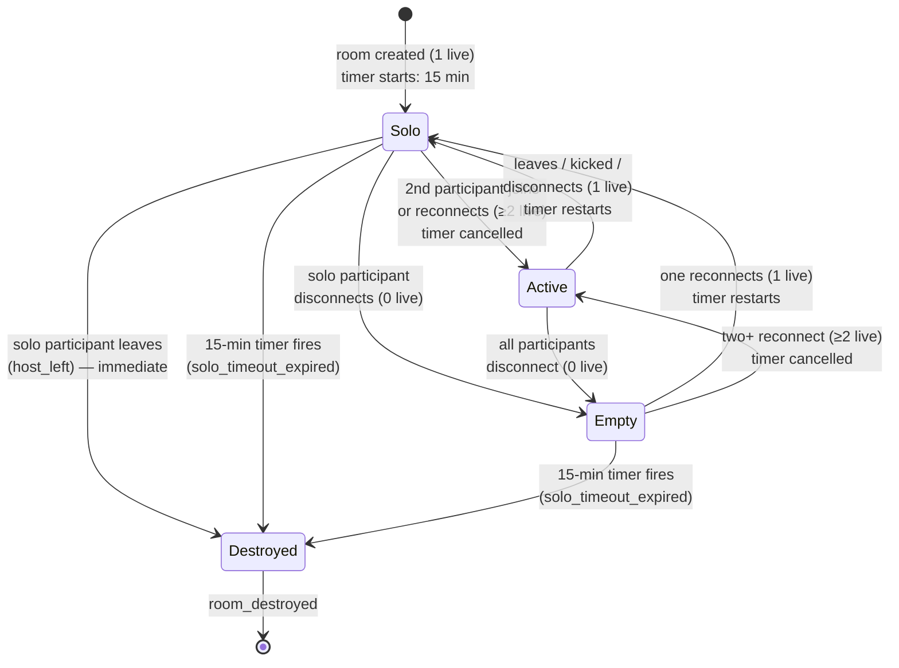
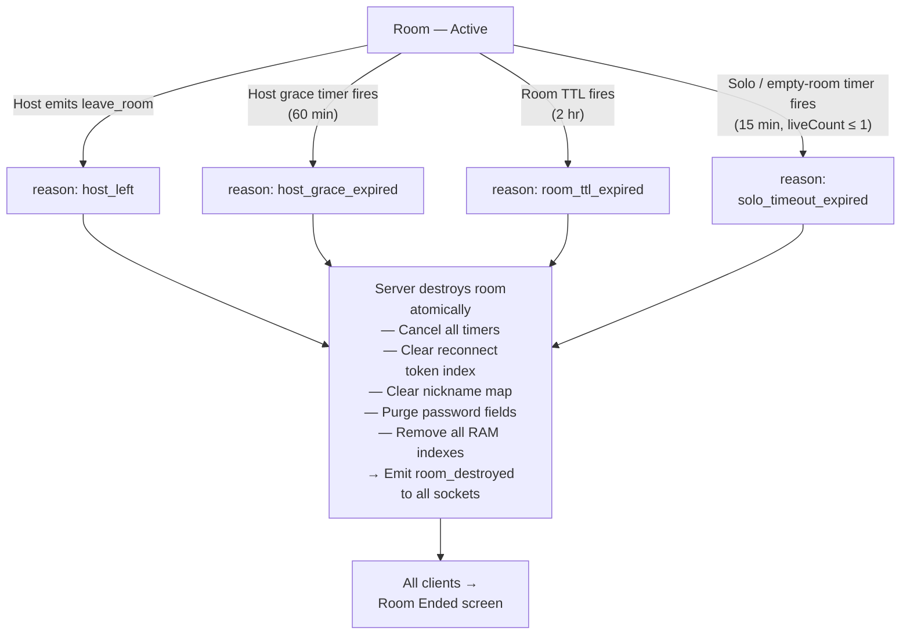
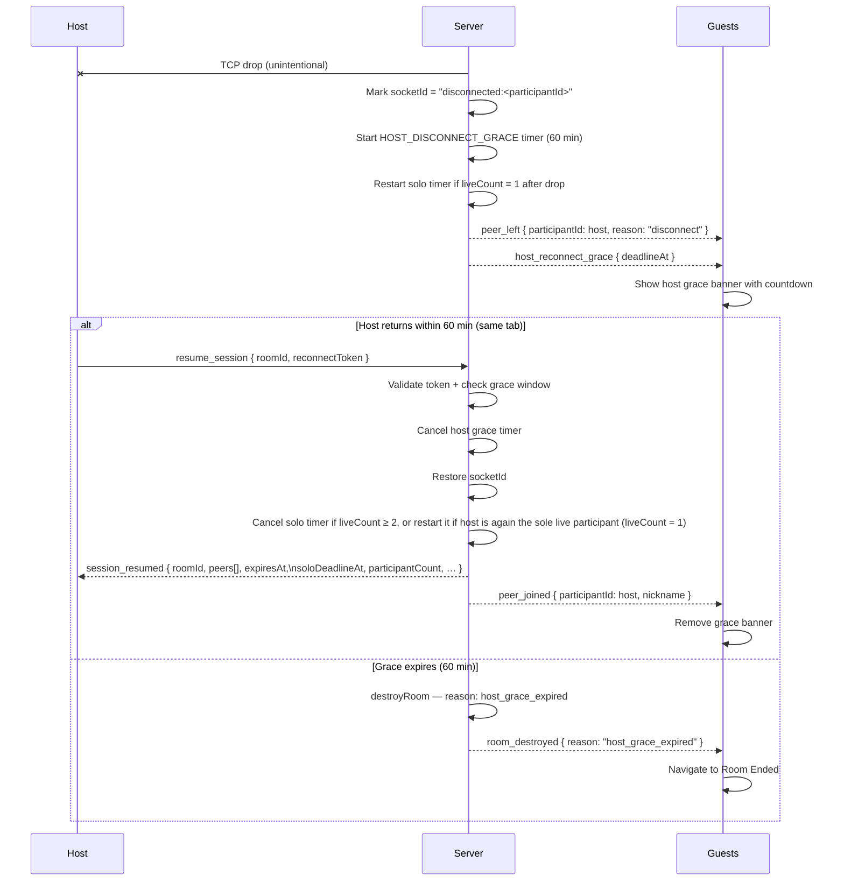
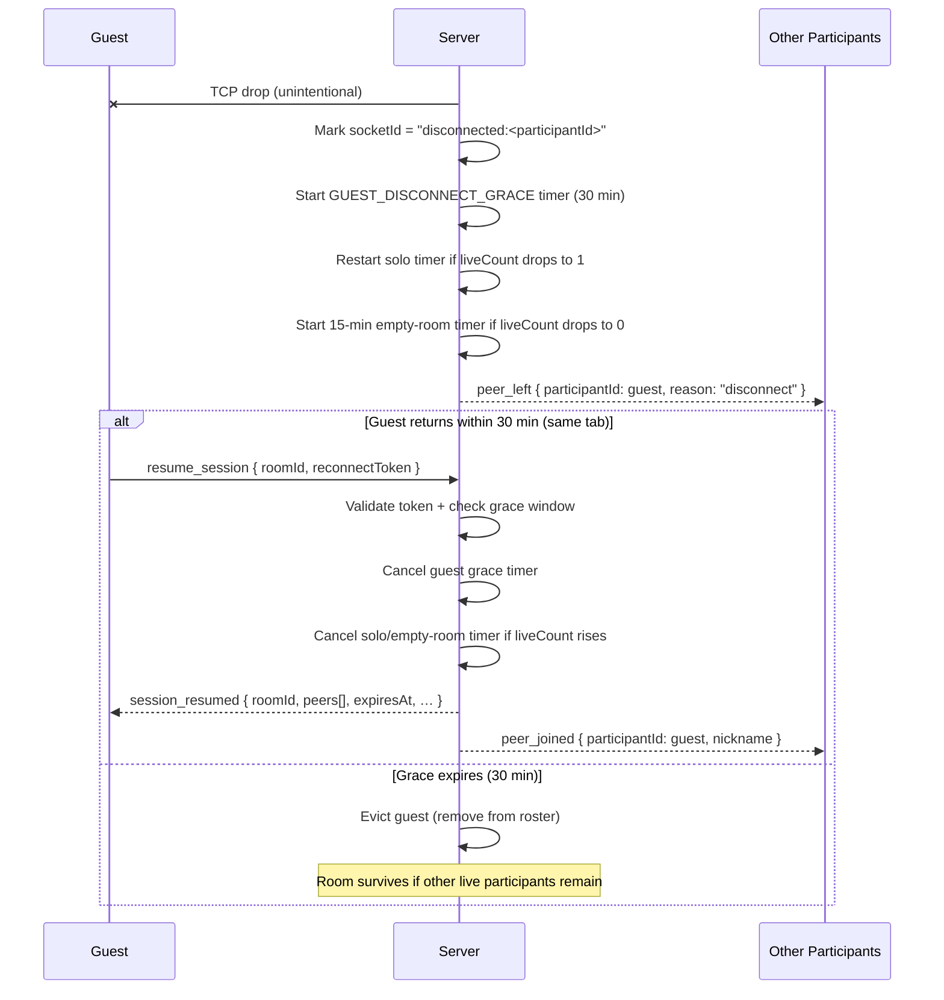
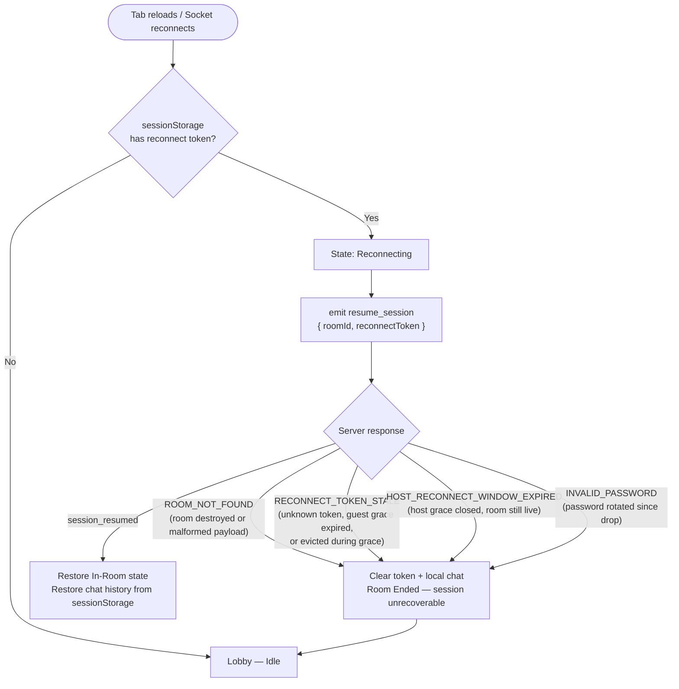
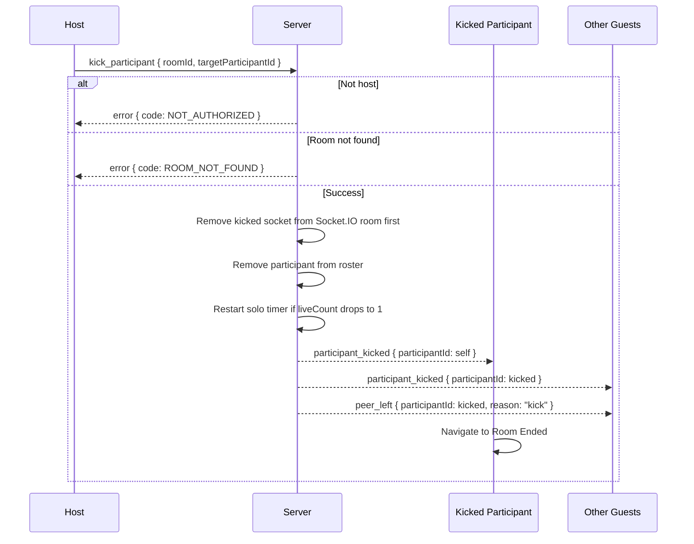

# Vapor Lifecycle (Source of Truth)

Date: 2026-06-29

Part of the Vapor system-design source-of-truth set — navigate via [INDEX.md](./INDEX.md). This file owns room lifecycle behavior: create/join/leave, disconnect grace, solo & empty-room timers, destruction reasons, `liveCount` semantics, reconnect, kick, abuse control, and room naming. Diagrams are co-located with the rules they depict. Constants are defined in [core-architecture.md](./core-architecture.md) §2; event payloads in [signaling-contract.md](./signaling-contract.md).

## 1) Lifecycle Rules

1. **Create room**
   - Create room in RAM, set requester as host, set expiry timer, start solo timer (host is alone at creation).
2. **Join room**
   - Reject if room missing/destroyed, invalid password, or room is full. A join is permitted even when `liveCount === 0` (no live presence); the new participant becomes the sole live participant and the solo timer (re)starts (`liveCount === 1`).
3. **Host leaves (`leave_room`)**
   - Destroy room immediately with reason `host_left`, evict all guests. This is the path taken whenever the host explicitly leaves — including when the host is the last to leave after every other participant has already gone.
4. **Guest leaves (`leave_room`)**
   - Remove guest from room. If live participants remain, broadcast `peer_left` (reason: `"leave"`) to them. If the guest was the last live participant (`liveCount` drops to 0 because the host was already disconnected/in grace), the room is **not** destroyed by the leave itself — it enters empty-room behavior (§3) and is destroyed with `solo_timeout_expired` only if no one returns before the 15-min timer fires.
5. **Unexpected disconnect**
   - Host: Start `HOST_DISCONNECT_GRACE_MS` (60 min) grace timer. Broadcast `peer_left` (reason: `"disconnect"`) + `host_reconnect_grace` to remaining live participants.
     - If `liveCount === 1` after host disconnect, restart solo timer from zero.
     - If `liveCount === 0` after host disconnect, the room enters empty-room behavior (§3): the 15-min timer governs destruction with `solo_timeout_expired` while the 60-min host grace also runs in parallel — the earliest active deadline wins.
   - Guest: Start `GUEST_DISCONNECT_GRACE_MS` (30 min) grace timer. Broadcast `peer_left` (reason: `"disconnect"`) to remaining live participants.
     - If `liveCount` drops to 1 after guest disconnect, restart solo timer from zero.
     - If `liveCount` drops to 0 after guest disconnect, the room enters empty-room behavior (§3): start the 15-min timer (cancelling any running solo timer first). If nobody reconnects before it fires, destroy with reason `solo_timeout_expired`. If any participant reconnects (`liveCount` rises to ≥ 1), cancel this timer.
   - Nickname reservations remain held during active grace windows: a reserved nickname cannot be claimed by a new joiner (the join is rejected with `INVALID_SIGNAL_PAYLOAD`) and is reclaimed by the original participant on `resume_session`.
6. **Resume session**
   - Accept only a valid reconnect token within the participant's grace window.
   - Restore existing participant identity, including reserved nickname.
   - Cancel the participant's personal grace timer.
   - Emit `session_resumed` to the reconnecting socket with current room state.
   - Broadcast `peer_joined` to all other live participants.
7. **Room TTL expires**
   - Destroy room regardless of participant count with reason `room_ttl_expired`.
8. **Idle / low-presence timeout** (`IDLE_ROOM_TIMEOUT_MS`, 15 min)
   - The timer applies to any lone live participant (host or guest) — it is not host-specific.
   - **Start/restart** (always cancel existing timer first) whenever `liveCount` becomes exactly 1 — including at room creation, when `liveCount` rises from 0 to 1 on reconnect or join, or when `liveCount` drops from higher to 1.
   - **Cancel** whenever `liveCount` rises to ≥ 2.
   - When `liveCount` drops to 0, restart the timer fresh as the empty-room timer (cancel the existing timer, start a new 15-min window — Rule 5 / §3); the room is **not** destroyed by reaching 0.
   - When the timer fires (at `liveCount` 1 or 0), destroy the room with reason `solo_timeout_expired`.
   - `soloDeadlineAt` is included in `room_created` (initial timer) and in the `peer_left` payload whenever the timer (re)starts.
9. **Kick**
   - Server removes the kicked participant from the Socket.IO room first, then broadcasts `participant_kicked` to remaining live participants. The kicked socket does not receive `peer_left` about itself.
   - `peer_left` (reason: `"kick"`) is broadcast to remaining live participants.
   - A kicked participant may rejoin the same room immediately; there is no server-side cooldown.
   - When a kick reduces `liveCount` to 1, restart the solo timer from zero.
   - A kick can never destroy a room: only the host may kick, the host is always a live participant, so `liveCount` after a kick is always ≥ 1.
10. **Effective destruction deadline precedence**
    - Effective deadline is the earliest active deadline among: room TTL, host grace deadline, solo / empty-room (15-min) timer deadline.
    - Voluntary host leave is immediate and not timer-mediated.
11. **Process restart**
    - All state is intentionally lost.

## 2) Clarification: Grace Period Does NOT Affect Participant Visibility

**Guest grace window** (`GUEST_DISCONNECT_GRACE_MS`) is **solely for reconnection eligibility**, not for visibility in the `participants` list:
- **On unexpected disconnect:** The disconnected participant is **immediately removed from the participants list** (`liveCount` excludes them). `peer_left` is broadcast to remaining participants so they know the guest is gone.
- **Grace window purpose:** Allows the participant to reconnect within 30 min without losing their nickname/session. Once the grace window expires, the room may be destroyed or the participant permanently evicted (see §3).
- **Participants list reflects live status only:** Only participants whose socket is connected (not in `"disconnected:"` state) appear as connected to other participants. Guests in grace windows do **not** appear as active participants in the UI, even though the server keeps their session alive internally.

This ensures other participants see an accurate real-time view of who is currently connected, while giving disconnected users time to return.

## 3) Live-Participant Count (`liveCount`) Rules

`liveCount` = count of `room.participants` entries whose `socketId` does **not** start with `"disconnected:"`.

### Empty-room behavior (`liveCount === 0`)

A room reaches `liveCount === 0` when the last live participant disconnects, or when the last live guest explicitly leaves while the host is already disconnected/in grace. (Host explicit leave never reaches this state — it destroys the room immediately with `host_left`.)

- Start the 15-min empty-room timer (cancelling any running idle timer first). Individual grace windows — including the 60-min host grace, when applicable — continue running in parallel; the earliest active deadline wins.
- If any participant returns before the timer fires (`liveCount` rises to ≥ 1 via `resume_session` or a new `join_room`), cancel the empty-room timer and restart the idle timer per §1 Rule 8 if `liveCount` = 1.
- If the timer fires with no return, destroy the room with reason `solo_timeout_expired`.

### `join_room` when `liveCount === 0`
- A new `join_room` is permitted when `liveCount === 0`. The joiner becomes the sole live participant, the empty-room timer is cancelled, and the idle timer starts (`liveCount === 1`).
- `resume_session` likewise lifts `liveCount` from 0 to ≥ 1 and is always permitted within its grace window.

### Peer visibility broadcasts
- **On explicit leave** (non-host): `peer_left` (reason: `"leave"`) to remaining live participants.
- **On disconnect** (host or guest): `peer_left` (reason: `"disconnect"`) to remaining live participants.
- **On kick**: server removes kicked socket first, then broadcasts `participant_kicked` to remaining live participants; `peer_left` (reason: `"kick"`) also broadcast to remaining live participants. The kicked socket receives `participant_kicked` only — not `peer_left`.
- **On host disconnect**: `host_reconnect_grace` additionally broadcast alongside `peer_left`.
- **On reconnect** (`resume_session` success): `session_resumed` to the reconnecting socket; `peer_joined` broadcast to all other live participants.
- **When idle timer (re)starts**: `soloDeadlineAt` included in the triggering `peer_left` payload (or in `room_created` for the initial creation timer).

### Frontend timer display
Each deadline has one UI surface. `RoomLifetimeChip` displays the room TTL from `expiresAt` only; `SoloWaitingChip` exclusively displays `soloDeadlineAt`; and active host reconnect grace is surfaced by a distinct persistent banner with its own second-ticking countdown. No deadline changes the countdown displayed by another surface.

### Frontend session persistence (reconnect on refresh)
- Reconnect token is stored in `sessionStorage` during an active room session.
- On mount (including browser refresh within the same tab), if a stored session exists the UI starts in a `'reconnecting'` state and immediately sends `resume_session` with `supportsSessionResumed: true`. Servers use the optional capability to return `session_resumed` to new clients and legacy `room_joined` to older clients.
- `sessionStorage` is explicitly cleared on voluntary leave, room destruction, or participant kick.
- React 18 StrictMode double-invokes effects; `clearStoredReconnectSession` must **not** be called inside the cleanup of the initial mount effect to avoid wiping the token before the second-mount reconnect attempt.

### Idle timer state machine

The idle timer governs rooms where at most one live participant remains. A participant counts as **live** only while their socket is connected; a disconnected participant still inside their reconnect grace window counts as 0. States: **Solo** (1 live, timer running), **Active** (≥2 live, timer cancelled), **Empty** (0 live, all within grace), **Destroyed** (terminal).

## 4) Room Cleanup, Destruction, and Reasoning

1. Keep a hard room TTL of 2 hours for all rooms.
2. If `liveCount` drops to 1, destroy after `IDLE_ROOM_TIMEOUT_MS` unless it rises to ≥ 2 first.
3. Enforce host-sovereign cleanup exactly as lifecycle rules specify.
4. Run a periodic sweeper to prune already-expired rooms and stale in-memory structures; the sweep interval should be configurable, coarse enough to avoid unnecessary churn, and expressed as an hour-based cadence rather than a sub-minute timer.
5. Under memory pressure, prioritize preserving active rooms and reject new `create_room` requests with `RATE_LIMITED`.
6. Room destruction must atomically remove reconnect index entries, clear timers, emit `room_destroyed`, remove all indexes, remove the room from `rooms`, and purge password fields before GC eligibility.

Canonical `room_destroyed.reason` values:
- `host_left` — host voluntarily left (immediate; any `liveCount`).
- `host_grace_expired` — host disconnected and did not reconnect before the 60-min host grace timer fired, while live participants remained (`liveCount` ≥ 1).
- `room_ttl_expired` — room reached its 2-hour maximum lifetime.
- `solo_timeout_expired` — `liveCount` stayed at ≤ 1 (one lone participant, or a fully empty room after all disconnected / the last live guest left while the host was already absent) for the 15-min timer with no qualifying return.

Rules:
- Exactly one reason must be emitted for each room destruction.
- Emitted reason must correspond to the first destroy trigger under lifecycle precedence.

### Room destruction paths

All conditions that destroy a room and the reason code emitted.

## 5) Disconnect & Reconnect Sequences

Legend: `→` request/emit, `⇢` response/broadcast, `✕←` unintentional TCP drop (connection severed before delivery).

### Host disconnect & reconnect

### Guest disconnect & reconnect

### Session persistence on page refresh

## 6) Kick Flow (Host Only)

Behavioral rules are in §1 Rule 9. Legend: `→` request/emit, `⇢` response/broadcast.

## 7) Create-Room Abuse Control

1. `create_room` runs through a modular guard chain (single-responsibility components):
   - rate limit guard,
   - temporary blocklist guard,
   - RAM pressure guard.
2. Incognito/private browsing must not be treated as a deterministic signal; browser mode detection is not reliable.
3. When create-room burst thresholds or memory-pressure thresholds are exceeded, the service may place the IP into a temporary in-memory blocklist with automatic expiry.
4. Any create rejection from abuse control returns deterministic `RATE_LIMITED`.
5. Abuse handling must prefer aggregate detection and temporary blocking over client-side friction.
6. Temporary blocks are operational controls, not identity proof, and must not be used to persist or infer user data.
7. Nickname uniqueness is room-scoped friction and must not be treated as security identity.

## 8) Room Naming

- Hosts may optionally provide a human-readable room name at creation via `create_room({ ..., roomName? })`.
- Room names are optional; omitting `roomName` or providing an empty string creates a room identified by its auto-generated `roomId` only.
- Room names are globally unique (case-insensitive) across all active rooms. A duplicate or invalid name is rejected with `INVALID_SIGNAL_PAYLOAD`.
- Accepted name format: 3–24 characters, letters/digits/hyphens/underscores, normalized to lowercase for the uniqueness index.
- Once set, a room name cannot be changed.
- `roomName` is included in `room_created`, `room_joined`, and `session_resumed` payloads; clients may display it and accept it as a join input in place of the raw `roomId`.
- `join_room` accepts either a `roomId` or a `roomName` in the `roomId` field — the server resolves the lookup transparently.
- `roomNameToId: Map<string, string>` on `SignalingState` maintains the name-to-ID index and is cleared on room destruction.
