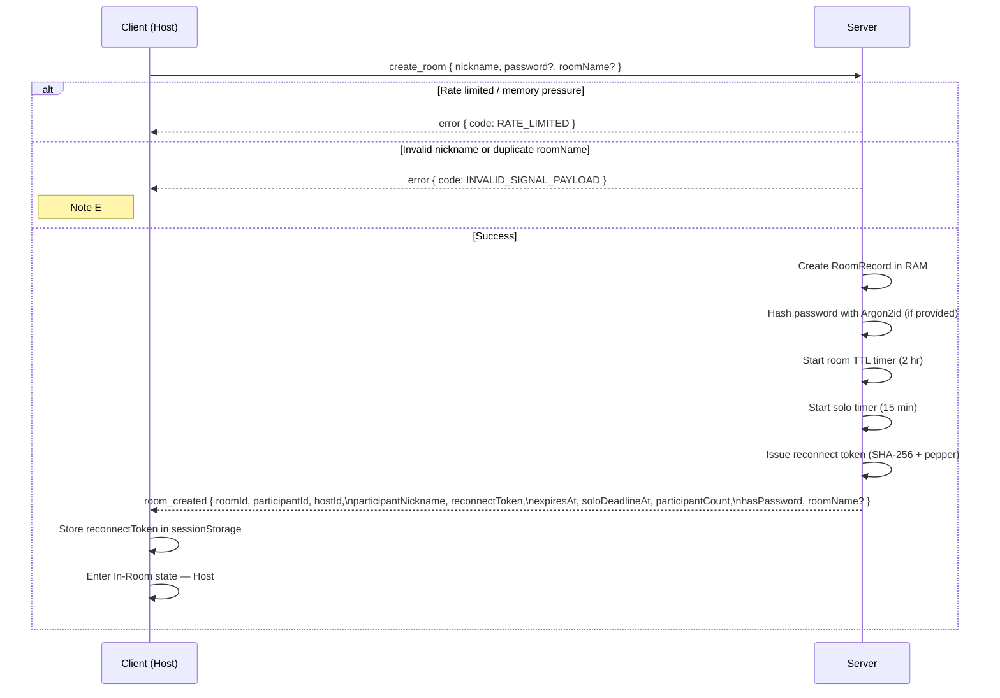
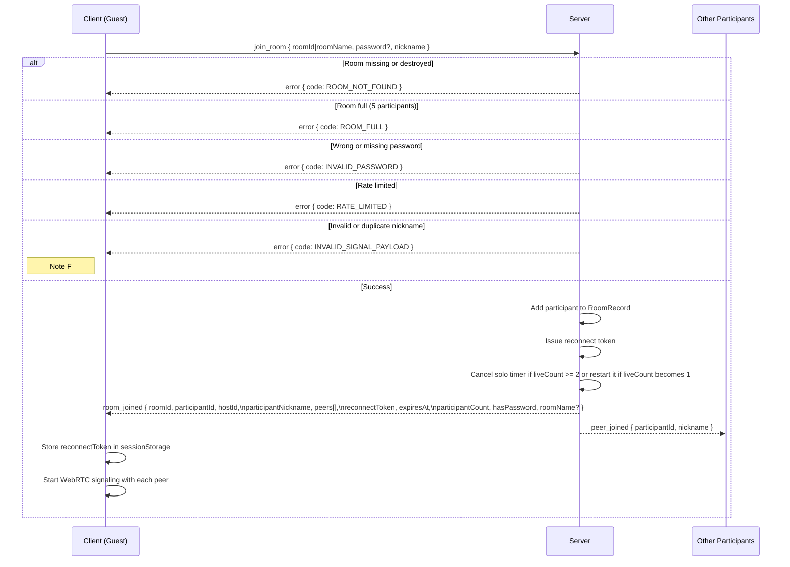
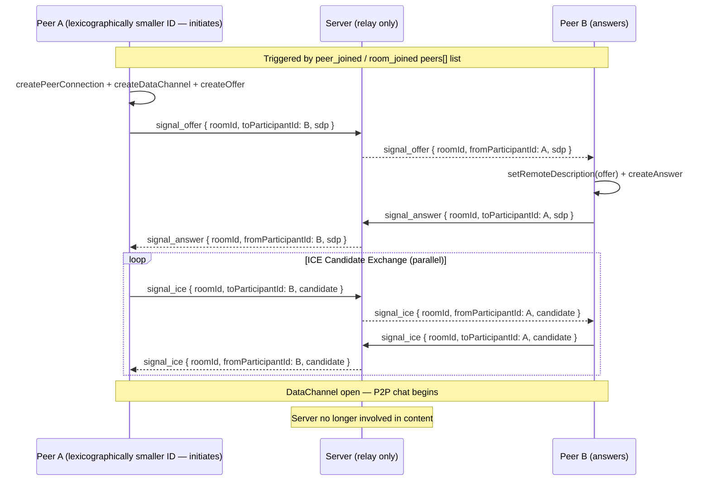

# Vapor Signaling Contract (Source of Truth)

Date: 2026-06-29

Part of the Vapor system-design source-of-truth set — navigate via [INDEX.md](./INDEX.md). This file owns the wire protocol: the socket event contract and payloads, the root `shared/` module, contract alignment, and the create/join/mesh signaling sequences. Lifecycle semantics for these events are in [lifecycle.md](./lifecycle.md); error codes in [error-codes.md](./error-codes.md).

## 1) Goal

Reduce frontend/backend contract drift by centralizing common signaling constants and payload types into one root-level shared module imported by both sides. All event names and error codes are imported from `shared/` — no magic strings in frontend or backend code.

## 2) Shared Module (`shared/`)

Both frontend and backend import from `shared/` to avoid drift.

```
shared/                  # Signaling contract (imported by both sides)
├── events.ts            # CLIENT_EVENT_NAMES, SERVER_EVENT_NAMES constants
├── error-codes.ts       # SIGNALING_ERROR_CODES constants
├── reasons.ts           # RoomDestroyedReason union type
├── policy.ts            # Rate limit thresholds, cooldown constants
├── payloads.ts          # All request/response payload interfaces
└── index.ts             # Barrel re-export
```

| File | Exports |
|---|---|
| `shared/events.ts` | `CLIENT_EVENT_NAMES`, `SERVER_EVENT_NAMES` |
| `shared/error-codes.ts` | `SIGNALING_ERROR_CODES` |
| `shared/reasons.ts` | `RoomDestroyedReason` union type |
| `shared/policy.ts` | Rate-limit and timeout policy constants (`JOIN_RATE_LIMIT_WINDOW_MS`, `JOIN_RATE_LIMIT_MAX`, `CREATE_RATE_LIMIT_WINDOW_MS`, `SWEEPER_INTERVAL_HOURS`, etc.) |
| `shared/payloads.ts` | All request/response payload interfaces for signaling events |
| `shared/index.ts` | Central barrel re-export for all of the above |

Frontend imports via the `@shared` path alias (configured in `vite.config.ts` and `tsconfig.json`).  
Backend imports via `backend/src/signaling/contracts.ts`, which re-exports from `shared/`.

```ts
// Wrong:
socket.emit("create_room", payload)
if (error.code === "ROOM_NOT_FOUND") { ... }

// Right:
socket.emit(CLIENT_EVENT_NAMES.CREATE_ROOM, payload)
if (error.code === SIGNALING_ERROR_CODES.ROOM_NOT_FOUND) { ... }
```

## 3) Socket Event Contract

**Client → Server**
- `create_room({ password?, nickname, roomName? })`
- `join_room({ roomId, password?, nickname })`
- `leave_room({ roomId })`
- `signal_offer({ roomId, toParticipantId, sdp })`
- `signal_answer({ roomId, toParticipantId, sdp })`
- `signal_ice({ roomId, toParticipantId, candidate })`
- `resume_session({ roomId, reconnectToken, supportsSessionResumed? })`
  - New clients send `supportsSessionResumed: true` and receive `session_resumed`.
  - Missing, false, or malformed capability values identify a legacy client, which receives the same successful resume payload on `room_joined`. Exactly one success event is emitted.
- `kick_participant({ roomId, targetParticipantId })` — host-only; evicts the specified participant

**Server → Client**
- `room_created({ roomId, participantId, hostId, participantNickname, reconnectToken, expiresAt, soloDeadlineAt, participantCount, hasPassword, roomName? })`
- `room_joined({ roomId, participantId, hostId, participantNickname, peers, reconnectToken, expiresAt, soloDeadlineAt, participantCount, reconnectingCount?, hasPassword, roomName? })`
  - `peers: Array<{ participantId: string; nickname: string | null; isHost: boolean }>`
- `session_resumed({ roomId, participantId, hostId, participantNickname, peers, reconnectToken, expiresAt, soloDeadlineAt, hostReconnectGraceDeadlineAt, participantCount, reconnectingCount?, hasPassword, roomName? })` — sent to a capability-advertising reconnecting participant on successful `resume_session`; `reconnectToken` is the rotated token replacing the one consumed by the resume
  - `peers: Array<{ participantId: string; nickname: string | null; isHost: boolean }>`
- `peer_joined({ participantId, nickname, participantCount, reconnectingCount? })`
- `peer_left({ participantId, reason, participantCount, reconnectingCount?, soloDeadlineAt? })` — `reason: "disconnect" | "leave" | "kick"`; `soloDeadlineAt` is included when the solo timer (re)starts as a result of this event
- `host_reconnect_grace({ deadlineAt })` — broadcast to remaining live participants when host disconnects
- `room_destroyed({ reason })`
- `participant_kicked({ participantId })` — broadcast to remaining live participants (after kicked socket is removed) when a participant is evicted by the host
- `error({ code, message })`
- `signal_offer({ roomId, fromParticipantId, sdp })` — relayed to target peer
- `signal_answer({ roomId, fromParticipantId, sdp })` — relayed to target peer
- `signal_ice({ roomId, fromParticipantId, candidate })` — relayed to target peer

## 4) Event Name Reference

### Client → Server

| Constant | String value |
|---|---|
| `CLIENT_EVENT_NAMES.CREATE_ROOM` | `"create_room"` |
| `CLIENT_EVENT_NAMES.JOIN_ROOM` | `"join_room"` |
| `CLIENT_EVENT_NAMES.LEAVE_ROOM` | `"leave_room"` |
| `CLIENT_EVENT_NAMES.SIGNAL_OFFER` | `"signal_offer"` |
| `CLIENT_EVENT_NAMES.SIGNAL_ANSWER` | `"signal_answer"` |
| `CLIENT_EVENT_NAMES.SIGNAL_ICE` | `"signal_ice"` |
| `CLIENT_EVENT_NAMES.RESUME_SESSION` | `"resume_session"` |
| `CLIENT_EVENT_NAMES.KICK_PARTICIPANT` | `"kick_participant"` |

### Server → Client

| Constant | String value |
|---|---|
| `SERVER_EVENT_NAMES.ROOM_CREATED` | `"room_created"` |
| `SERVER_EVENT_NAMES.ROOM_JOINED` | `"room_joined"` |
| `SERVER_EVENT_NAMES.SESSION_RESUMED` | `"session_resumed"` |
| `SERVER_EVENT_NAMES.PEER_JOINED` | `"peer_joined"` |
| `SERVER_EVENT_NAMES.PEER_LEFT` | `"peer_left"` |
| `SERVER_EVENT_NAMES.HOST_RECONNECT_GRACE` | `"host_reconnect_grace"` |
| `SERVER_EVENT_NAMES.ROOM_DESTROYED` | `"room_destroyed"` |
| `SERVER_EVENT_NAMES.PARTICIPANT_KICKED` | `"participant_kicked"` |
| `SERVER_EVENT_NAMES.ERROR` | `"error"` |
| `SERVER_EVENT_NAMES.SIGNAL_OFFER` | `"signal_offer"` |
| `SERVER_EVENT_NAMES.SIGNAL_ANSWER` | `"signal_answer"` |
| `SERVER_EVENT_NAMES.SIGNAL_ICE` | `"signal_ice"` |

## 5) Payload Alignment

- `expiresAt` is typed as `number` (Unix ms) on both sides.
- `PeerLeftPayload.reason` is `"disconnect" | "leave" | "kick"`.
- Error code set is aligned with the deterministic contract; frontend-only `UNKNOWN` mapping lives only in `error-copy.ts`.
- `kick_participant` and `participant_kicked` payloads are defined in `shared/payloads.ts` and consumed by both sides.
- `peers` in `room_joined` and `session_resumed` is `Array<{ participantId: string; nickname: string | null; isHost: boolean }>`.
- `soloDeadlineAt` is included in `room_created`, `room_joined`, `session_resumed`, and `peer_left` payloads where applicable.
- `participantCount` is included in `peer_joined` and `peer_left` — reflects the live participant count after the join/departure is applied.
- `reconnectingCount` is included in `room_joined`, `session_resumed`, `peer_joined`, and `peer_left` — reflects grace-held disconnected participant slots after the event is applied.
- Resume success is capability-negotiated: `supportsSessionResumed === true` selects `session_resumed`; otherwise the server selects legacy `room_joined`. The payload data is equivalent except that only `session_resumed` exposes `hostReconnectGraceDeadlineAt`.

## 6) Adoption

**Backend**
- `backend/src/signaling/contracts.ts` consumes and re-exports values from root `shared/`.
- `backend/src/signaling/registerSocketHandlers.ts` and all extracted handler modules under `backend/src/signaling/handlers/` use contract constants for all event names and error codes.

**Frontend**
- `frontend/src/features/room/types.ts` imports event name constants, error codes, and all payload types from `@shared`, re-exports shared types, and defines the `RoomSocketClient` interface used throughout the frontend.
- `state-utils.ts` state reducers reference shared payload shapes.
- No magic strings in frontend socket event handlers.

## 7) Signaling Sequences

Legend: `→` request/emit, `⇢` response/broadcast.

### Create Room



**Note E — `INVALID_SIGNAL_PAYLOAD` on `create_room`.** Returned when the nickname fails format validation (3–24 characters; letters, numbers, single spaces, `_`, `-`, `.`; no control/invisible Unicode characters), or when the optional `roomName` is syntactically invalid or already taken by an active room.

### Join Room



**Note F — `INVALID_SIGNAL_PAYLOAD` on `join_room`.** Returned when the nickname fails format validation (same rules as creation), or when the nickname is already held by a participant in that room — whether **currently connected** or **disconnected but still within their grace window**. A grace-window nickname stays reserved for its holder so they can reclaim it on `resume_session`; the new joiner must choose a different nickname. The reservation is released only on grace-window expiry, eviction, or room destruction. A room with `liveCount === 0` remains joinable during its 15-minute empty-room window; a successful join makes the new participant the sole live participant and restarts the idle timer.

### WebRTC Peer Mesh Setup

Performed after join for each new peer pair. Server relays SDP/ICE only — never sees content.


